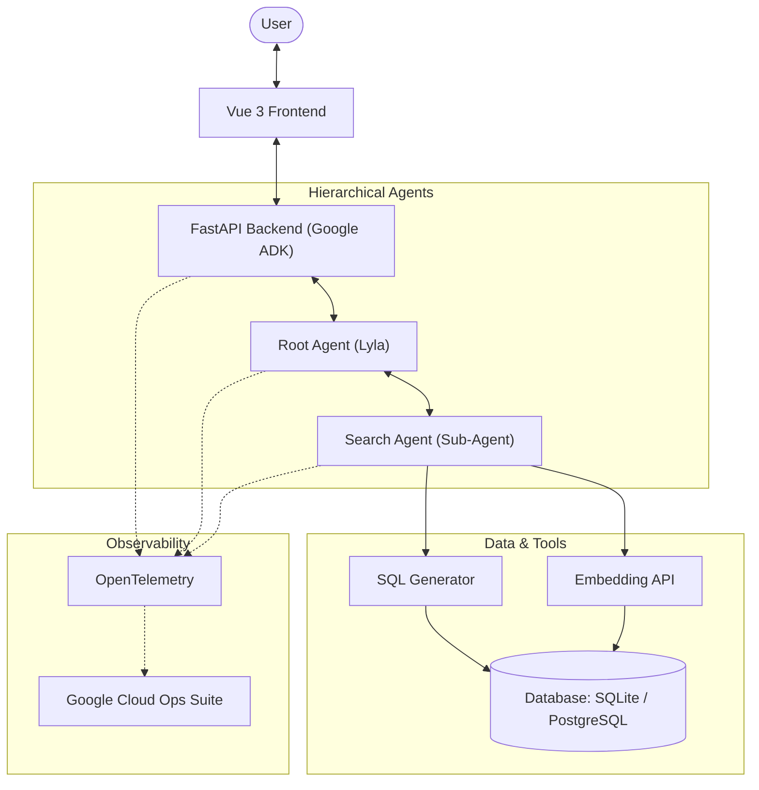

# The London Travel Company

The London Travel Company is a generative AI-powered travel assistant designed to help users plan their trips to London. It provides tailored information about attractions, activities, and points of interest based on user queries.

## System Architecture



## Core Search Components

The **Search Agent** uses a hybrid search strategy to provide highly relevant results by combining semantic understanding with structured data filtering.

### 1. SQL Generator
The **SQL Generator** is an LLM-powered tool that translates natural language constraints into valid SQL filtering logic. 
* **Role**: It extracts structured parameters from the user's query (e.g., "activities under 50 euros" or "suitable for kids") and generates a strict SQL `WHERE` clause.
* **Benefit**: Enables precise filtering on non-semantic data like cost, duration, and ratings that vector search alone cannot handle reliably.

### 2. Embedding API
The **Embedding API** powers the semantic search capability of the assistant.
* **Model**: Uses the **`text-embedding-005`** model via the Google GenAI SDK.
* **Role**: It converts the user's interests (e.g., "street food" or "hidden history") into numerical vectors. 
* **Benefit**: Allows the agent to find activities based on their *meaning* rather than just keyword matching, using vector similarity search against the database.

By combining these two components, the agent can fulfill complex requests like *"Find me affordable museum tours,"* where the Embedding API finds "museum tours" and the SQL Generator ensures they are "affordable."

## Frontend

The application features a modern, responsive frontend built with **Vue 3**, **Vite**, and **Tailwind CSS**. 

* **API Integration**: Connects to the FastAPI agent backend to provide real-time responses from the hierarchical agents.

## AI Agent Architecture

The core of this application is a hierarchical AI agent built with the Python-based [Google Agent Development Kit (ADK)](https://github.com/google/agent-development-kit). The agent, named "Lyla", is exposed via a FastAPI backend and is designed to be a friendly and expert London travel planner.

The architecture consists of a main "root agent" that handles user interaction and delegates specialized tasks to a sub-agent.

### Root Agent (`london_agent`)

* **Orchestration:** This is the primary agent that receives the user's request from the API. Its main responsibility is to understand the user's intent, ask clarifying questions (e.g., duration of stay, interests), and decide when to call its tools.
* **Prompting:** The agent's personality and workflow are defined in `london_agent/prompts.py`. It is instructed to be a friendly travel planner that gathers initial requirements before acting.
* **Tooling:** The root agent has one primary tool: `call_db_agent`. This tool does not perform the database lookup directly; instead, it invokes the specialized `database_agent` to handle the request.

### Sub-Agent (`database_agent`)

*   **Specialization**: This agent, defined in `agents/london_agent/sub_agents/search_agent/`, is an expert at interacting with the travel database. Its sole purpose is to translate a user's request into a database query.
*   **Tooling**: The `database_agent` has its own tool, `get_activities_tool`, which executes a SQL query against the database to find relevant activities based on the user's refined request (e.g., "find historical sites for a 3-day trip").
*   **Data Access**: It supports both **SQLite** (local development) and **PostgreSQL** (production) for storing and retrieving activity data, including vector embeddings for semantic search.

This hierarchical structure allows for a clean separation of concerns: the root agent manages the conversation, while the sub-agent manages the technical details of data retrieval.

### Observability with OpenTelemetry

The agent is fully instrumented using OpenTelemetry, an open-source observability framework. This provides deep visibility into the agent's performance and behavior by exporting traces, logs, and metrics to Google Cloud's operations suite (Cloud Trace, Cloud Logging, and Cloud Monitoring).

A key component of this is the **`GoogleGenAiSdkInstrumentor`**. By calling the `.instrument()` method, this library automatically "patches" the Google Generative AI SDK to capture detailed information about every interaction with the underlying language model (Gemini).

This creates detailed traces for each LLM call, automatically recording critical data such as:

* The full prompt sent to the model.
* The model's response.
* The model name being used.
* Execution time and other performance metrics.

This level of automatic instrumentation is invaluable for debugging the agent's reasoning process, evaluating the quality of its outputs, and monitoring the cost and performance of the application.

## Cloud Deployment with Terraform

This repository provides multiple, distinct Terraform configurations to support different deployment and management scenarios.

### Main Deployment (`deploy/terraform_qwiklabs`)

This is the primary, all-in-one configuration for deploying the entire application to a single GCP project. The "qwiklabs" name suggests it's designed for a self-contained, reproducible setup.

Running this Terraform will provision a complete serverless environment, including:

* **Cloud Run:** Deploys the backend agent as a serverless container (`cloudrun.tf`).
* **App Hub:** Registers the deployed services as a formal application within Google Cloud's App Hub for visibility and management (`apphub.tf`).
* **Service Accounts & APIs:** Configures all necessary IAM service accounts and enables the required Google Cloud APIs.

### Central Artifact Management (`deploy/terraform`)

This is a specialized configuration intended for repository maintainers. Its purpose is to set up a **separate, central GCP project** dedicated to CI/CD and artifact storage. It does **not** deploy the application itself.

This configuration provisions:

* **Artifact Registry:** Creates a repository to host the official Docker images for the application (`ar.tf`).
* **Cloud Build:** Sets up a build trigger (`cb-trigger.tf`) to automate the building and publishing of images.

The CI pipeline, defined in `deploy/ci/ci.yaml`, is then used to push images to this central location.

### Standalone App Hub Registration (`deploy/terraform_apphub`)

This is a minimal configuration whose only purpose is to register an application with Google Cloud's App Hub. This is useful if the application was deployed using a different method (e.g., manually) and you want to add it to App Hub for centralized management without running the full `terraform_qwiklabs` deployment.

## Getting Started Locally

### Prerequisites

* Docker and docker-compose (optional, for containerized setup)
* Python 3.10+
* Node.js 18+ and npm
* A Google Cloud project with Owner privileges (to create a Service Account with the necessary roles).

### Development Setup (No Docker)

For a faster development loop, you can run the components separately:

#### 1. Backend Agent
```bash
cd agents
python3 -m venv .venv
source .venv/bin/activate
pip install -r requirements.txt
# Set environment variables (see below)
python3 -m src.main
```

#### 2. Frontend
```bash
cd frontend
npm install
npm run dev
```

### Running with Docker

1. **Clone the repository:**

    ```bash
    git clone https://github.com/GoogleCloudPlatform/the-london-travel-company.git
    cd the-london-travel-company
    ```

2. **Create a Google Cloud Service Account:**
    Create a service account with the following roles:
    * `roles/aiplatform.user`
    * `roles/monitoring.metricWriter`
    * `roles/logging.logWriter`
    * `roles/telemetry.writer`

3. **Service Account Key:**
    Download the JSON key for the service account and save it as `.key.json` in the root directory of the project.

4. **Create a `.env` file:**
    Create a `.env` file in the root directory and add the following environment variables, replacing the values with your Google Cloud project details:

    ```bash
    PROJECT_ID=your-gcp-project-id
    LOCATION=your-gcp-region
    ```

5. **Start the application:**

    ```bash
    docker-compose up -d
    ```

6. **Access the application:**
    The backend API will be available at `http://localhost:8001`.
