# Deploy Apps Quickly with ADC

## Introduction

In this codelab, you will learn how to deploy a full-stack application using Google Cloud **App Design Centre (ADC)**. You will deploy "The Cymbal London Concierge" application, which includes a Vue 3 frontend, a FastAPI backend, and an MCP server that holds the data for the application.

ADC allows you to define your application architecture visually and deploy it as a single unit, managing dependencies and connections automatically.

### What you'll do

- Set up App Design Centre.
- Visually assemble the application components.
- Deploy the application architecture.
- Verify the running application.

### What you'll need

- A web browser such as [Chrome](https://www.google.com/chrome/).
- A Google Cloud project with billing enabled.

This codelab is for developers of all levels, including beginners.

**Estimated Duration:** 60 minutes
**Estimated Cost:** Under $2.00 USD

---

## Before you begin

Duration: 05:00

> aside positive
>
> **For Google Cloud Credits:** To help you get started, redeem your free Google Cloud credits using this [link](https://goo.gle/49kkXjB).

#### Create a Google Cloud Project

1. In the [Google Cloud Console](https://console.cloud.google.com), [**select or create a Google Cloud project**](https://cloud.google.com/resource-manager/docs/creating-managing-projects).
2. Make sure that billing is enabled for your Cloud project.

#### Start Cloud Shell

1. Click **Activate Cloud Shell** at the top of the Google Cloud console.
2. Verify authentication:

```
gcloud auth list
```

3. Confirm your project:

```
gcloud config get project
```

4. Set it if needed:

```
export PROJECT_ID=<YOUR_PROJECT_ID>
gcloud config set project $PROJECT_ID
```

---

## Set up App Design Centre

Duration: 05:00

Before you can assemble your application, you need to set up your workspace in App Design Centre.

1. In the Google Cloud Console, search for **App Design Centre** and navigate to it.
2. If this is your first time using ADC in this project, you will see a setup screen.
3. Click **Go to Setup**.

   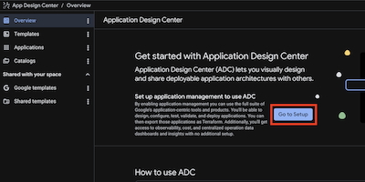


4. You will be prompted to enable required APIs if they are not already enabled. Click **Enable** to proceed.

   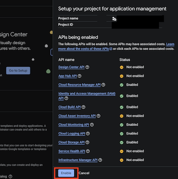


---

## Task 2. Exploring ADC Features

In this task, you learn the core components of ADC: Spaces, Catalogs, and Templates.

### ADC Spaces

A Space is a location for creating templates and deploying apps. Each space belongs to a Google Cloud project. ADC creates a default-space during initial setup, but you are free later to create other spaces in different regions.

To view your spaces via the terminal, perform the following steps:

1. Click **Open Editor** on the Cloud Shell toolbar or use the terminal.
2. Run the following command:

```bash
gcloud alpha design-center spaces list \
--project="your PROJECT ID" \
--location=us-central1
```

You should see an output that looks like this that indicates that the default-space is present for the region.

```yaml
createTime: '20XXXX-XX-XXT09:19:29.456016967Z'
displayName: default-space
enableGcpSharedTemplates: true
name: projects/your-project-id/locations/us-central1/spaces/default-space
```

### ADC Catalogs

A Catalog allows you to store and share app templates across different Spaces. ADC includes a default-catalog that starts empty. Catalogs are a critical feature for enterprises as they enable architecture governance by providing a standard set of patterns for use across an organization.

### Templates

Templates define blueprints for application infrastructure stored in Terraform format. You can find templates in three locations:

- **Google Templates**: Predefined, Google-opinionated architectures. The goal is to provide a rich repository of Well-Architected patterns, driving re-use of opinionated best practices.
- **Shared Templates**: Templates shared with your space from across your organization.
- **Templates**: Custom blueprints created within your specific space.

---

## Assemble the Template

Duration: 15:00

In this step, you will take on the role of a **Platform Team** engineer. Your goal is to create a reusable, secure, and compliant template for agentic applications in your organization. You will add components and configure restrictions to ensure that any application deployed from this template complies with your company's cloud policies.

### 1. Create a New Design

1. In the App Design Centre console, click **Templates > Create Template**.
2. Name your template `simple-3-tier-agentic-app` as this template will be used to deploy the `Cymbal London Concierge` application, and other similar applications.

   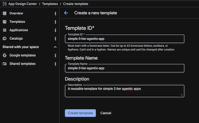

### 2. Add the Data MCP Server

This component handles the database interactions and vector search.

1. Click **Add Component** > **Cloud Run (Service)**. If you click on that component, you will see a **component id** in the top right corner. It will be of the form `cloud-run-1`. We can change it to `data-mcp-server`, by editing it in the **code** view (discussed later), but let's leave it as it is. 

   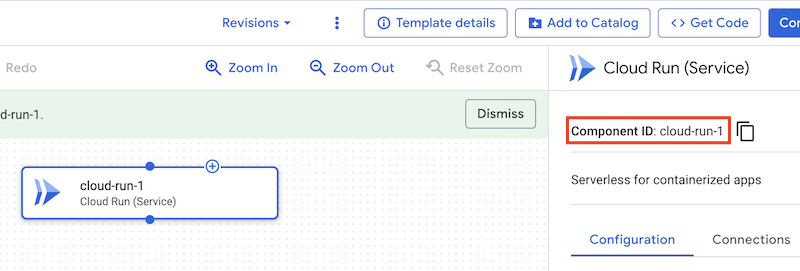

2. Enter the **Service Name**: `data-mcp-server`.

3. Under **Show advanced settings**, Set the **Members** to: `allUsers`. *(Note: In a production environment, you would likely restrict this, but we use it here for codelab simplicity.)*
4. Under **Show advanced settings**, Set the **VPC ACCESS**, set the **Egress** to: `PRIVATE_RANGES_ONLY`.
5. Optionally, under **Show advanced settings**, uncheck **Enable Prometheus Sidecar**.

   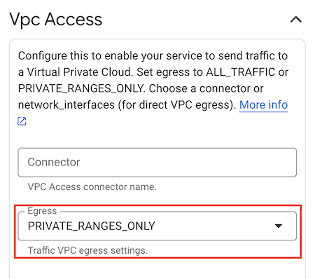

6. Click **Save**.

### 3. Add the Agent Backend

This is the FastAPI application that orchestrates the agentic behavior.

1. Click **Add Component** > **Cloud Run (Service)**.
2. Name it `agent-backend`.
4. Under **Show advanced fields**, check the **Create Service Account** and add the following roles under **Service Account Project Roles** one at a time:  
   - `roles/monitoring.metricWriter`
   - `roles/logging.logWriter`
   - `roles/cloudtrace.agent`
   - `roles/telemetry.writer`
   - `roles/serviceusage.serviceUsageConsumer`.
   These roles will allow the agent to use Cloud Monitoring, Cloud Logging, and Cloud Trace. **Compliance Config:** The platform team enforces the principle of least privilege by explicitly listing required roles.
   
   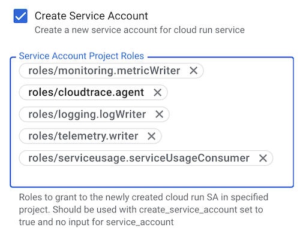

5. Under **Show advanced settings**, Set the **Members** to: `allUsers`.
6. Under **Show advanced settings**, Set the **VPC ACCESS**, set the **Egress** to: `PRIVATE_RANGES_ONLY`. 
7. Connect the `agent-backend` to `data-mcp-server`, by dragging a connection from the `agent-backend` to the `data-mcp-server`.
8. Click **Save**.


### 4. Add the Frontend

The front end UI.

1. Click **Add Component** > **Cloud Run (Service)**.
2. Enter the **Service Name**:  `frontend`.
3. Under **Show advanced settings**, uncheck **Create Service Account**
4. Under **Show advanced settings**, Set the **Ingress** to: `INGRESS_TRAFFIC_INTERNAL_LOADBALANCER`. **Compliance Config:** Direct public access to the frontend container is blocked, forcing traffic through the load balancer.
5. Under **Show advanced settings**, Set the **Members** to: `allUsers`.
7. Click **Save**.
6. Connect the `frontend` to `agent-backend`, by dragging a connection from the `frontend` to the `agent-backend`.

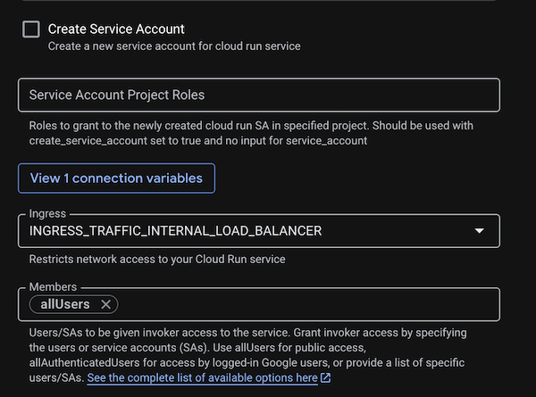

### 5. Add a vertex AI component

1. Click **Add Component** > **Vertex AI**.
2. Name it `vertex-ai`.
3. Connect it to the `agent-backend` and the `data-mcp-server` by dragging two connections from the `vertex-ai` to the `agent-backend` and `data-mcp-server` respectively. The roles `aiplatform.user` will already assigned to the service accounts of `agent-backend` and `data-mcp-server` by the virtue of them being connected to the vertex AI component.

### 6. Add the Global Load Balancer

The Load Balancer exposes your frontend to the public internet. In ADC, this is split into a Backend and a Frontend component.

#### A. Add the Load Balancer Backend

1. Click **Add Component > **Global Cloud Load Balancing (Backend)**.
2. Name it `galb-backend`.
3. Click **Add Connection** and connect it to `frontend`. 

#### B. Add the Load Balancer Frontend

1. Click **Add Component > **Global Cloud Load Balancing (Frontend)**.
2. Name it `galb-frontend`.
4. Click **Add Connection** and connect it to `galb-backend`.
5. Connect the `galb-frontend` to `galb-backend`, by dragging a connection from the `galb-frontend` to the `galb-backend`.

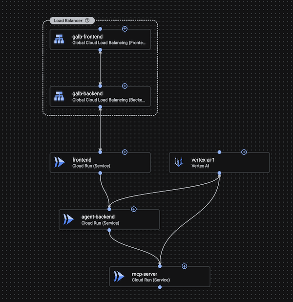
---

## Deploy the Application

Duration: 10:00

Once assembled, the app team can use this generic template to deploy the `cymbal-london-concierge` application.

1. In the App Design Centre console, with the template open, click on  'Configure an app' button.
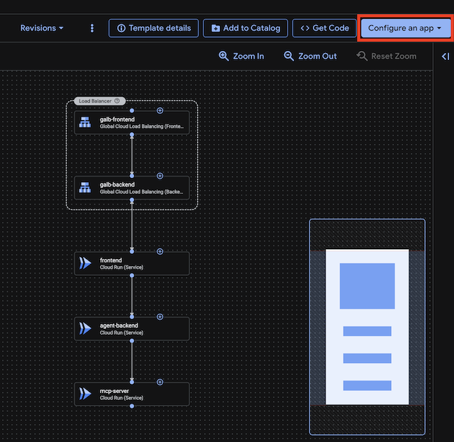

2. Click **Create new application**.
3. Configure the Application:
   - **Application Name**: `cymbal-london-concierge`
   - **Deployment project**: Your project id
   - **Region**: `us-central1`
   - **Input Attributes>Environment**: `Development`
   - **Input Attributes>Criticality**: `Low` 
4. Click **Create Application**.

   For a production deployment, you would select 'Production' for Environment and 'High' for Criticality. These are tags that will help your SREs and operations team sort and prioritize work on any issues that occur.

5. This should open up the deployment details page with the application template. Given that this is only a template, we still need to add configuration that is specific to our application. 

6. Let's configure the frontend. Click on the **frontend** component.

   1. Click on **Containers > Edit Container**.
   2. We need to replace the generic container image with the one we want to use for our application.
   3. Set the **Container Image** to:
   `us-central1-docker.pkg.dev/o11y-movie-guru/london-travel-agency/frontend:codelab-c2c6-v1`

   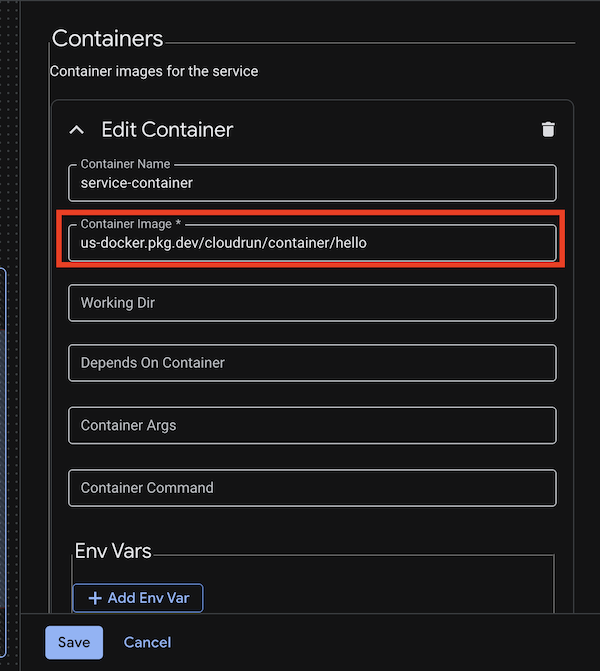

   4. Set the port `http1` to `80`.
   5. Set the following **Environment Variables**:
      - `API_BASE_URL`: `module.cloud-run-2.service_uri` (ensure that the `cloud-run-2` is the name of the agent backend component, if not replace it with the actual name of the component)
   6. Click **Save**.

7. Let's configure the agent backend. Click on the **agent-backend** component.

   1. Click on **Containers > Edit Container**.
   2. We need to replace the generic container image with the one we want to use for our application.
   3. Set the **Container Image** to:
   `us-central1-docker.pkg.dev/o11y-movie-guru/london-travel-agency/agent:codelab-c2c6-v1`
   4. Set the following **Environment Variables**:
   - `GOOGLE_CLOUD_PROJECT`: `<YOUR_PROJECT_ID>`
   - `GOOGLE_CLOUD_LOCATION`: `us-central1`
   - `DATA_BACKEND_URL`: `module.cloud-run-1.service_uri` (ensure that the `cloud-run-1` is the name of the data mcp server component, if not replace it with the actual name of the component)
   5. Set the port `http1` to `8000`.
   7. Click **Save**.

8. Let's configure the data mcp server. Click on the **data-mcp-server** component.

   1. Click on **Containers > Edit Container**.
   2. We need to replace the generic container image with the one we want to use for our application.
   3. Set the **Container Image** to:
   `us-central1-docker.pkg.dev/o11y-movie-guru/london-travel-agency/data_mcp:codelab-c2c6-v1`
   4. Set the following **Environment Variables**:
   - `GOOGLE_CLOUD_PROJECT`: `<YOUR_PROJECT_ID>`
   - `GOOGLE_CLOUD_LOCATION`: `us-central1`
   - `DB_TYPE`: `sqlite`
   - `EMBEDDING_MODEL`: `text-embedding-005`
   5. Set the port `http1` to `8002`.
   6. Click **Save**.

   In a real production scenario, you would also configure a database like **CloudSQL** or **AlloyDB** and provide the database connection string for the data mcp server. But for this lab, we will use an in-memory database. You would also make the mcp server and the database private and only accessible from the agent backend, or from within the network. 

9. Click on the **Code** button on the top of the page to view the terraform code for the application. You can also download the terraform code for the application by clicking on the **Get Code** button to store it in your code base.

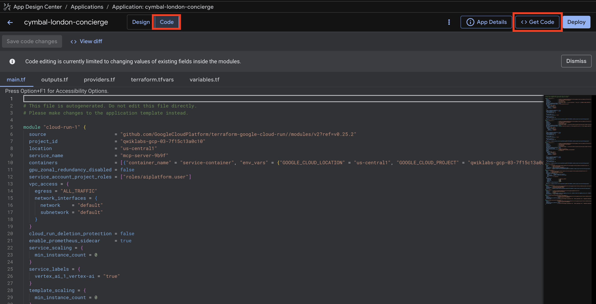

10. Click on the **Deploy** button on the top right corner of the page to deploy the application.

11. The deployment page will ask you to create a service account for the deployment pipeline or choose an existing one. Click on **Create Service Account** (it will autofill a name) and then **Proceed**. This will take a few seconds to create a new service account.

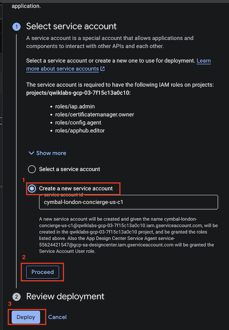

12. Once the service account is created, the page will refresh and you will see the Select Service Account with a checkmark next to it. 

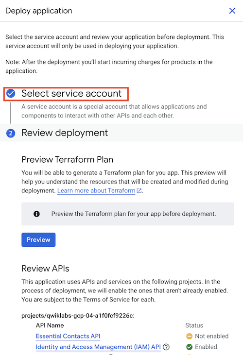

13. Then click **Deploy** at the bottom of the page.

13. It will take a few minutes to complete. Once the deployment is complete, you will see a green checkmark next to each component. You can also check the status of the deployment by clicking on the **Link to logs** button which will open the cloud build logs.


---

## Verify the Application

Duration: 05:00

Let's test if the agent is alive. Since the frontend uses internal ingress, we will verify the frontend through the load balancer for this lab. Given that it is a Global Load Balancer, it will take a few minutes (upto 10 minutes) to propagate the changes globally.


```bash
AGENT_URL=$(gcloud run services describe agent-backend --region=us-central1 --format="value(status.url)")

curl ${AGENT_URL}/health
```

You should see output: `OK`.

Now, test the agent with a chat prompt:

```bash
curl -X POST ${AGENT_URL}/chat \
  -H "Content-Type: application/json" \
  -d '{"message": "What are the top attractions in London?"}'
```

---

## Clean Up

Duration: 05:00

To avoid ongoing charges, delete the resources created.

You can delete the deployment from the App Design Centre console or by deleting the project if you created one for this lab.

---

## Congratulations

Congratulations! You have deployed a 3-tier application architecture using App Design Centre.

#### What you've learned

- How to visually assemble a cloud architecture using ADC.
- How to set up ADC and enable APIs via UI.
- How to deploy applications using ADC.

#### Reference docs

- [App Design Centre Documentation](https://cloud.google.com/app-design-centre/docs)
